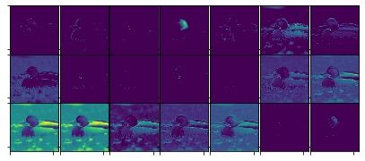
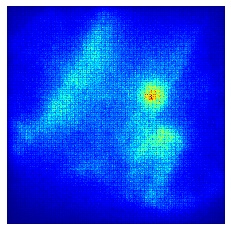

  

  

# Capstone Project: Machine Learning for Image Classification

  

## Project Description from Moodle

  

Image classification is a challenging problem. This project aims to implement and evaluate machine learning methods, including deep learning, for image classification. Your task is to implement several machine learning methods and evaluate their image classification performance using the ImageNet database (http://image-net.org/index). Third party tools/libraries can be used for implementing machine learning methods. You are expected to find a good machine learning method, based on which you can prepare for a possible entry to an available image classification competition (e.g., http://image-net.org/challenges/LSVRC/2017/).

  

## Abstract

  

  

Over the past few years, there have been numerous innovative discoveries researchers made that largely pushed forward the knowledge and understanding of how Machine Learning, in particular Deep Learning, can be used to allow computers recognise and categorise objects. The project aims to answer the question of how machines can identify and classify images using Convolutional Neural Networks and look thoroughly on the most important milestones achieved throughout the past few years, i.e. 2012's AlexNet, ResNet, GoogLeNet, VGG architectures. Google's NasNet combines Reinforcement Learning with Deep Learning, empowering a machine to find the perfect architecture building block without a need of human supervisor. Deep Learning models, built upon the architectures enumerated, were trained on Linnaeus 5 dataset to evaluate and compare their performance, flaws and robustness. The findings among with the real-time prediction capabilities, kernel visualisations, saliency maps and dense layer iteration outputs, were embedded in a Python application utilising industry-leading Qt graphical user interface toolkit. Based on the findings from the established milestone architectures, a custom Convolutional Neural Network architecture was devised and submitted for Bengali Classification Challenge. Open-source implementations of common building blocks in Keras and Tensorflow were used for Deep Neural Network experimentation and design. The final accuracy obtained on the test set was 94%.

  

  

## Dependencies

  

  

  

The crucial dependencies used in the project and how to install them using PIP (the package installer for Python) are listed below:

  

  

  

- Tensorflow with Keras: Machine and Deep Learning library for Python, pip installation command:

  

> pip install tensorflow-gpu

  

  

- NumPy: Numerical Python library, pip installation command:

  

> pip install numpy

  

  

  

- Matplotlib: Python's basic plotting library, pip installation command:

  

> pip install matplotlib

  

  

  

- OpenCV: real-time Computer Vision and image processing library, pip installation command:

  

> pip install opencv

  

  

  

- SKLearn: another Machine Learning library for Python, used in the project to encode categorical features as a one-hot numeric array (LabelEncoder module) and to create confusion matrices, pip installation command:

  

> pip install sklearn

  
Alternative ways to install the required dependencies can be found in the following documentation:
- Tensorflow: https://www.tensorflow.org/install
- SKLearn: https://scikit-learn.org/stable/install.html
- OpenCV: https://docs.opencv.org/master/d5/de5/tutorial_py_setup_in_windows.html
- Matplotlib: https://matplotlib.org/users/installing.html
- NumPy: https://docs.scipy.org/doc/numpy/user/install.html
  

## Repository

  

  

  

There are two main folders in the repository: code and documents:

  

  

  

1. Code:

  

  

- six Python's scripts, one for each of the architecture (AlexNet, GoogLeNet, MNASNet, ResNet, VGG, ZFNet) that are used to train the models, and a Predict_Plot script to provide wanted visualisations and predictions

  

  

- bengali_class_challenge_kaggle folder that consists of eight interactive Jupyter notebooks, each of the notebook provides a different architecture solution to the Kaggle Challenge problem or show some important changes in the result (i.e. how does SGD perform in the problem compared to Adam)

  

  

- main_application folder that consist of the GUI program for Open Day, it provides a real time predictions on a separate dataset and gives some interesting visualisations of Saliency Maps, training process, and output layers:

  

  

Due to the GitLab requirement of limited data usage, the training dataset could not be uploaded. The original dataset used in the project - Linnaeus 5 - can be downloaded from the following link: http://chaladze.com/l5/

  

  

2. Documents:

  

  

- the folder provides screenshots and documentations of the results and work done throughout the year, it consists of i.e. performance of different models in form of either confusion matrices or loss/accuracy graphs, performance of various experiments on the Kaggle Challenge task, and sample visualisations to look at without the need of running the main application such as:

- example confusion matrix:

  

- example convolutional layer output:

  

  

- example class training visualisation:

  

  

- example saliency map:

  

  

The main_application uses all six models which are loaded into either computer's RAM or GPU's memory depending on the tensorflow version used and since some models can weight as much as 1.6 GBs it is recommended to have no less than 6 GB of RAM in the GPU.

  

The code takes form of an either Python's scripts (model training, main application) or Jupyter Notebooks (Kaggle Challenge). To train the model ensure the dataset is downloaded and put into the root folder and run a command such as 'python AlexNet.py'. To run the main application use

  

> python Controller.py

  

 To run a Jupyter Notebook use the following command in the command line at the notebooks directory:

> Jupyter Notebook

The Jupyter Notebooks can be executed cell by cell from the top.

The testing is done by using cross-validation evaluation measure. The results are shown in form of confusion matrices and loss/validation graphs. The methodology of conducting the experiments and evaluation is in detail described in the final paper which can be found in the document subfolder and is send also on Faser electronic system.